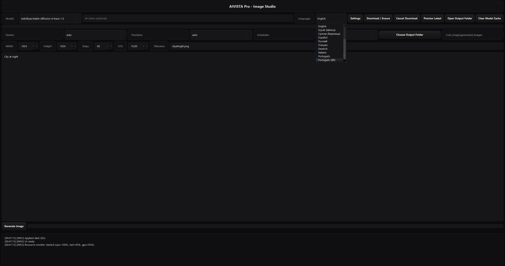
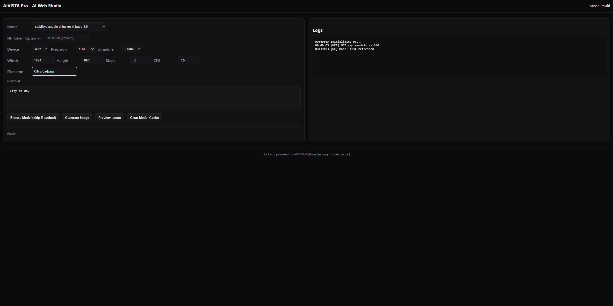
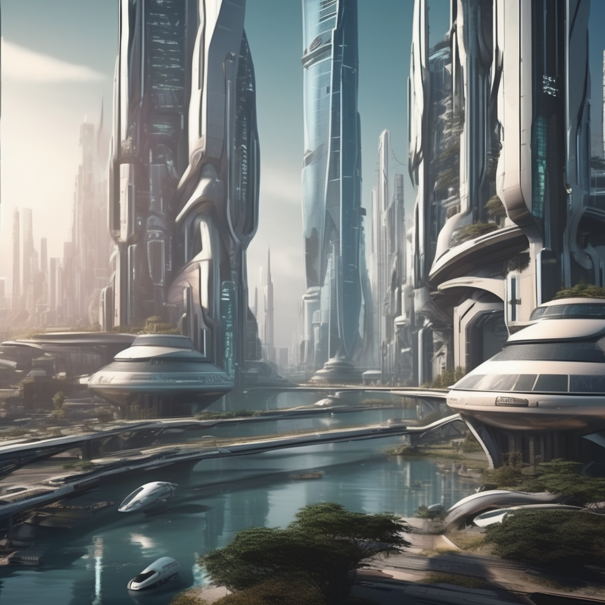

# AI VISTA - Professional Local & LAN Image Studio

**AI VISTA** is a local-first, professional image generation studio built for artists, developers, and creators who want full control over their workflows. It supports **Stable Diffusion** models including SDXL, offers a polished web UI, and an optional PyQt desktop interface for local or LAN use.

---

## Table of Contents

- [What is AI VISTA](#what-is-ai-vista)
- [Key Features](#key-features)
- [Screenshots](#screenshots)
- [Supported Models](#supported-models)
- [Installation & Quick Start](#installation--quick-start)
- [Running on LAN](#running-on-lan)
- [Web UI Usage](#web-ui-usage)
- [API Examples](#api-examples)
- [Tips & Configuration](#tips--configuration)
- [Troubleshooting](#troubleshooting)
- [Files in the Repo](#files-in-the-repo)
- [Contributing & License](#contributing--license)

---

## What is AI VISTA

AI VISTA is a **full-featured local image generation platform** that combines:

- A FastAPI backend serving Stable Diffusion pipelines (official and community models)
- A responsive web UI for both desktop and mobile devices
- Real-time log streaming and progress updates
- Optional PyQt6 desktop interface with dark theme and icons
- Efficient model caching and organized image storage

Designed for creators who need **speed, stability, and control**.

---

## Key Features

- Run locally or on your LAN
- Supports SDXL, SD2, SD3, Dreamlike, OpenJourney, Realistic Vision, and more
- Live streaming of generation progress
- Safe filename handling and unique outputs
- Optional PyQt desktop UI with responsive layout
- Easy model management
- Image preview and logging for professional workflows

---

## Screenshots

**Desktop UI:**  

**Web UI (Mobile/Browser):**  

**Example Generated Image:**  

---

## Supported Models

Some of the supported models include:

- **SDXL:** `stabilityai/stable-diffusion-xl-base-1.0`, `stabilityai/stable-diffusion-xl-refiner-1.0`
- **Stability AI official:** SD2, SD3, SDXL VAE models
- **Classic / Community SD:** v1.4, v1.5
- **Dreamlike / Photoreal:** dreamlike-photoreal-2.0, Counterfeit V2/V3
- **OpenJourney:** openjourney-v4, openjourney
- **Anime / Anything:** anything-v4.0, waifu-diffusion
- **Realistic Vision:** V2, V5, RealVisXL
- **Kandinsky / Research:** kandinsky-2.2
- **Inpainting / Edit / Instruct:** instruct-pix2pix
- **Special Community Models:** classic-anim-diffusion, taesd-x4-upscaler

> You can add or update models in the `model_cache` folder.

---

## Installation & Quick Start

git clone https://github.com/Luka12-dev/AI-VISTA.git
cd AI-VISTA

# Create virtual environment
python -m venv .venv

# Activate venv
# Windows
.venv\Scripts\activate
# Linux/macOS
source .venv/bin/activate

# Install dependencies
pip install --upgrade pip
pip install fastapi uvicorn torch torchvision diffusers transformers accelerate safetensors huggingface-hub

## Running the Server
python server.py
Choose your mode:

1 = local-only (127.0.0.1)
2 = LAN / multi-device (0.0.0.0)
Default port = 8000
Open the browser:

Local: http://127.0.0.1:8000

LAN: http://<LAN_IP>:8000

## Running on LAN
Start server with mode 2 (0.0.0.0)

+ Make sure port 8000 is allowed in firewall

+ Connect from any device on your local network using LAN IP

+ Web UI Usage

+ Select the desired model from the dropdown

+ Optionally press Ensure Model to download it to model_cache

+ Enter your prompt

+ Adjust Width, Height, Steps, and CFG Scale

+ Click Generate Image

+ Progress is streamed live; image opens when done

## API Examples
Streamed Generation

GET /api/generate/stream?payload={"prompt":"A futuristic city","model":"stabilityai/stable-diffusion-xl-base-1.0","width":1024,"height":1024,"steps":30,"guidance":7.5,"filename":"city.png"}
Preview Last Generated Image

curl http://127.0.0.1:8000/api/preview
# Returns JSON: {"ok": true, "url": "/generated_images/<file>"}
Tips & Configuration
GPU recommended for SDXL models

Use precision=float16 to save VRAM

Enable xFormers or memory offload

Reduce width/height/steps if you run out of memory

# Pre-download models for faster generation

Troubleshooting
CUDA out-of-memory → lower resolution or step count

Port 8000 in use → change port in server.py or run:

uvicorn server:app --host 0.0.0.0 --port 9000
Missing static files → check that /app.js & /styles.css exist

License: MIT